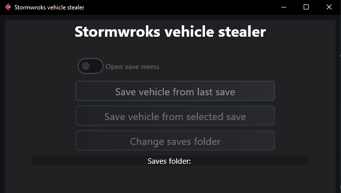
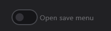
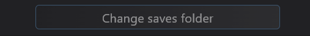

# [Stormworks vehicle stealer]
**Program for saving vehicles from multiplayer server in game [Stormworks](https://store.steampowered.com/app/573090/Stormworks_Build_and_Rescue/).**
### **[ABOUT PROGRAM]** ###
---
**$\textcolor{red}{\text{THIS PROGRAM IS MADE TO DEMONSTRATE THE CURRENT GAME VULNERABILITY}}$**
**$\textcolor{red}{\text{TO THE GAME DEVELOPERS AND TO DRAFT THEIR ATTENTION TO THE PROBLEM.}}$**
---


### **[ Options ]**

This program makes a new save with vehicles that spawned above the start Island in coordinates 0, 0.

<ul>
<li><h3>1. ''Open save menu'' switch button.</h3> - This button switch the save menu.</li>
</ul>



<ul>
<li><h3>1. ''Save vehicle from last save'' button.</h3> - This button makes world with spawned vehicles from last saved world (<b>The last world must be saved by this program</b>).</li>
</ul>


<ul>
<li><h3>1. ''Save vehicle from selected save'' button.</h3> - This button makes world with spawned vehicles from selected world (<b>The selected world must be saved by this program</b>).</li>
</ul>


<ul>
<li><h3>1. ''Change saves folder'' button.</h3> - This button Change saves folder of Stormworks (<b>This folder is detected automatically</b> you can see it in "Saves folder" field).</li>
</ul>



### **[WARNING]** ###
This program can create additional file and directory (```Roaming\xml_stealer\xml_stealer.cfg```).

