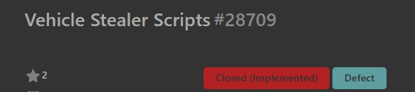

# [Stormworks vehicle stealer]

### **MY CONGRATS, THEY WANT TO FIX THE ISSUE** 

###

### Link to report: https://geometa.co.uk/support/stormworks/28709

### Why was this so important to NMC?

- The first such scripts were created by lolqd (Now asico), after which they spread to our RP.
Basically, our vehicles were stolen; this script was like some kind of revenge.
- We made the script public, so those who wanted to buy a private cheat disappeared.

### Why such a slow response?

- Not all people are cheaters.
- Half of the players play with workshop vehicles, and the rest build "boring" vehicles.
- The main victims were small RP clans with high-quality vehicles, who didn't worry about their vehicles during the RP downtime because they didn't spawn them on RP servers.
- As a fourth reason, I can point to the developers with their very important crab updates.

### P.S.

Unfortunately, the community and developers took a very long time to respond to this vulnerability, especially since I literally pointed it out (no one cared).

I want to apologize to all players (not counting some people from DRD) for the stolen vehicles. I finally don't have to worry about refactoring THIS anymore. This is likely the last commit in this repository.

I must warn you right away that players like (lolqd/asico misdeveloped) will continue to steal vehicles and search for vulnerabilities in the game in this area.
